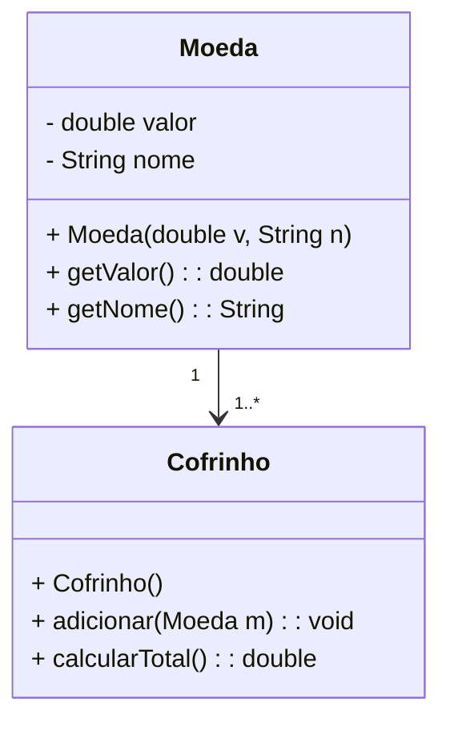
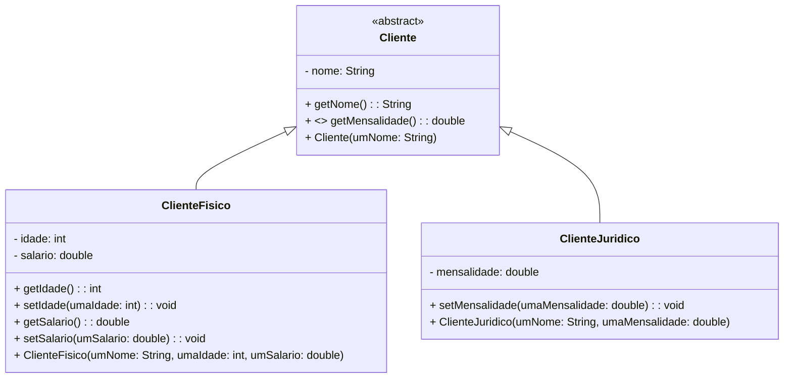

# **Laboratório 3 – TypeScript e Objetos**

## **Exercícios**
Utilize o ambiente `Node.js` para executar no console o código `TypeScript` destes exercícios. Você pode utilizar como base o projeto configurado no Laboratório 1.

---

1. Crie uma classe que represente um Círculo. Esta classe deve possuir as propriedades de um ponto central (coordenadas `x`, `y`) e um tamanho de raio. Defina métodos para o cálculo da área do círculo e do comprimento da circunferência. Escreva um bloco de código para testar a implementação do círculo.

---

2. Sejam os seguintes objetos representados em um diagrama de classes UML:

- a) Implemente as classes correspondentes em TypeScript. Você pode implementar os métodos get apresentados na classe Moeda como: campos somente de leitura, métodos de acesso ou propriedades de leitura. Utilize uma coleção adequada para implementar a coleção de moedas na classe Cofrinho.
- b) Escreva um bloco de código para testar a implementação.
- c) Utilize um código para serializar um objeto Cofrinho em JSON e procure entender o formato de string que foi construído.

---

3. Altere a implementação da classe Cofrinho do exercício anterior para incluir:
- Método que retorna o valor da menor moeda armazenada.
- Método que retorna uma instância da menor moeda armazenada.
- Método que retorna um mapa/dicionário com a frequência (o número de moedas) de cada moeda existente (1 centavo, 5 centavos, 10 centavos, 25 centavos, 50 centavos, 1 real) no cofrinho.

---

4. Seja a seguinte hierarquia de herança representada em um diagrama e classes UML:

 
- a) Implemente as classes em TypeScript. Para o cálculo do valor da mensalidade utilize as seguintes informações: Esta empresa de seguros cobra uma mensalidade correspondente a 10% do salário se o cliente tem menos de 60 anos e 15% se o cliente tem 60 anos ou mais, no caso de clientes que são pessoa física. Para pessoas jurídicas é cobrada uma mensalidade variável, calculada através de negociações com o cliente.
- b) Implemente uma classe CadastroClientes para armazenar o cadastro de clientes da empresa de seguros. Apresente métodos para adicionar um cliente ao cadastro e retornar uma string contendo a listagem de todos os clientes, mostrando seu nome e o valor da mensalidade a ser paga. Utilize uma coleção em memória.

---

## **Recursos Adicionais**

- [Documentação oficial do TypeScript](https://www.typescriptlang.org/docs/handbook/tsconfig-json.html)
- [ts-node](https://typestrong.org/ts-node/)
- [nodemon](https://nodemon.io/)
